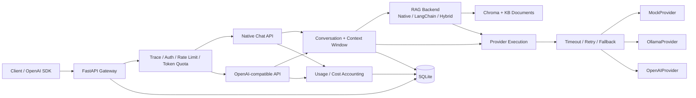

# chat-api

一个面向生产工程实践的 **FastAPI LLM Chat Gateway**。项目聚焦单租户聊天网关的核心工程能力：统一 Provider、OpenAI-compatible API、Conversation 持久化、RAG、Provider resilience、Usage/Cost、API Key、限流与 token quota、可复现并发压测，以及 Docker/CI 发布闭环。

> 发布状态：v2-plus 实现基线已完成代码、测试、性能基线和 Docker 发布验收，功能范围已冻结。正式发布以 `master` 和 release tag 为准；后续仅做必要维护、演示和复习，不再新增业务能力。

## 1. Core capabilities

| Area | Capability |
|---|---|
| Chat API | Native `/chat`、SSE `/chat/stream` |
| OpenAI compatibility | `/v1/chat/completions` sync/stream |
| Provider abstraction | Mock / Ollama / OpenAI |
| Conversation | Conversation / Message 持久化、多会话历史、分页查询 |
| Context window | 最近轮次 + token budget 截断，保留当前问题 |
| RAG | Native / LangChain backend、Hybrid retrieval、citations、KB 管理 |
| Resilience | timeout、retry、exponential backoff、opt-in fallback |
| Streaming safety | 仅首个非空 token 前允许 retry/fallback，输出后禁止重放 |
| Usage | request-level token accounting |
| Cost | 版本化价格目录、Decimal 估算、不可变 UsageCost 快照 |
| Authentication | API Key、Bearer / `X-API-Key`、HMAC-SHA256 + server pepper |
| Limits | caller/IP request rate limit、caller-aware daily token quota |
| Observability | trace id、latency、provider execution chain、RAG timing |
| Load testing | native/OpenAI-compatible sync/stream、RPS、P50/P95/P99、TTFT |
| Release | Python 3.10、non-root Docker、Compose named volumes、healthcheck、CI smoke |

## 2. Architecture



项目定位是 **production-oriented**，不是“完全 production-ready”。当前发布单元明确采用单 worker + SQLite，保留真实并发边界，不把单机测试结果包装成水平扩展能力。

## 3. Quick start

### 3.1 Docker（推荐）

要求：

- Docker Engine / Docker Desktop
- Docker Compose v2.24+

启动：

```bash
git clone https://github.com/ConnorLuis/chat-api.git
cd chat-api

docker compose up --build --detach
docker compose ps
```

默认 Compose：

- 使用 `chat-api:v2-plus`
- 固定容器内 SQLite、runs、KB 路径
- 使用 3 个 named volumes 持久化数据
- 通过 `host.docker.internal` 访问宿主机 Ollama
- 暴露 `${CHAT_API_PORT:-8000}:8000`

健康检查：

```bash
curl http://127.0.0.1:8000/health
curl http://127.0.0.1:8000/ready
```

完整协议 smoke：

```bash
python scripts/docker_smoke_test.py
```

或使用一键脚本：

```bash
bash scripts/docker_start.sh
```

停止容器：

```bash
docker compose down
```

named volumes 默认保留。只有明确需要删除持久化数据时才使用 `docker compose down -v`。

### 3.2 Local Python

要求 Python 3.10+。

```bash
conda activate chatapi

python -m pip install \
  -r requirements.txt \
  -r requirements-dev.txt \
  -r requirements-langchain.txt \
  -r requirements-openai.txt

cp .env.example .env
set -a && source .env && set +a

python -m src.app.db

python -m uvicorn src.app.main:app \
  --host 127.0.0.1 \
  --port 8000
```

`constraints.txt` 固定核心和兼容性关键依赖。依赖升级后应重新执行 `pip check`、warnings-as-errors compile 和完整测试。

### 3.3 Optional dependencies

LangChain RAG backend：

```bash
python -m pip install -r requirements-langchain.txt
```

OpenAI Provider：

```bash
python -m pip install -r requirements-openai.txt
```

真实 Hugging Face embedding：

```bash
python -m pip install -r requirements-embeddings.txt
export EMBEDDING_PROVIDER=hf
```

默认 embedding 模型 ID：

```text
maidalun1020/bce-embedding-base_v1
```

## 4. API overview

### Health

```text
GET /health
GET /ready
```

### Native chat

```text
POST /chat
POST /chat/stream
```

同步示例：

```bash
curl -sS http://127.0.0.1:8000/chat \
  -H 'Content-Type: application/json' \
  -d '{
    "provider": "mock",
    "messages": [
      {"role": "user", "content": "hello"}
    ],
    "temperature": 0,
    "max_tokens": 64,
    "use_kb": false
  }'
```

流式接口使用 SSE，正常链路为：

```text
meta -> token* -> usage -> done
```

Provider 在首 token 之后失败时不会 retry/fallback，也不会从头重放已经发送的内容。

### OpenAI-compatible chat

```text
POST /v1/chat/completions
```

同步示例：

```bash
curl -sS http://127.0.0.1:8000/v1/chat/completions \
  -H 'Content-Type: application/json' \
  -d '{
    "provider": "mock",
    "model": "mock-load-model",
    "messages": [
      {"role": "user", "content": "hello"}
    ],
    "temperature": 0,
    "max_tokens": 64
  }'
```

流式请求设置：

```json
{
  "stream": true,
  "stream_options": {
    "include_usage": true
  }
}
```

正常终止：

```text
data: [DONE]
```

### Other APIs

项目还提供：

- Conversation 创建、列表、查询、重命名、删除和消息分页查询
- `/auth/whoami`
- `/prompt/compare`
- `/usage/pricing`
- `/usage/records`
- `/usage/summary`
- `/usage/daily`
- `/usage/providers`
- `/usage/models`
- KB 文档入库、查询、删除与检索接口

完整行为和示例见：

- `docs/v2_demo_guide.md`
- `docs/system_design.md`

## 5. Conversation and context window

Conversation 层基于 SQLAlchemy 2.x：

- `Conversation`
- `Message`
- 稳定 `sequence_no`
- 会话级历史加载
- 消息分页
- Conversation 删除级联清理 Message

聊天请求可携带 `conversation_id`。历史上下文支持：

1. 最近 N 轮；
2. token budget；
3. 当前问题优先保留；
4. 返回截断状态用于 observability。

持久化语义是 **完整成功后原子保存本轮 user/assistant**：

```text
success:
user + assistant -> commit

provider failure:
no half conversation

stream client disconnect / stream failure:
no half conversation
```

因此失败不会留下只有 user、没有 assistant 的半轮对话。

## 6. Provider abstraction and resilience

Provider 统一为 `ChatProvider`：

```text
MockProvider
OllamaProvider
OpenAIProvider
```

`ProviderFactory` 隔离不同 SDK / HTTP provider 的调用差异。

### Retry classification

只对明确可恢复错误执行有界重试，例如：

- connect timeout
- 首 token 前 read timeout
- HTTP 429
- HTTP 502 / 503 / 504

以下错误不进行无意义重试：

- 400 类请求错误
- authentication / authorization
- provider configuration error
- optional dependency missing
- protocol / response contract error

### Backoff

Provider execution 支持：

- bounded retry attempts
- exponential backoff
- jitter
- explicit timeout
- optional fallback chain

### Fallback boundary

同步路径可在当前 Provider 可恢复失败后尝试显式 fallback。

流式路径采用更严格语义：

```text
before first non-empty token:
retry / fallback allowed

after first non-empty token:
retry forbidden
fallback forbidden
replay forbidden
```

这避免客户端收到重复内容。

fallback 必须显式配置，不会默认回退到 MockProvider。

### Observability

原生响应暴露：

```text
provider_execution
```

OpenAI-compatible 响应暴露：

```text
gateway.provider_execution
```

记录包括：

- requested provider
- active/final provider
- attempt chain
- retry count
- fallback used
- provider/model

## 7. RAG

支持：

```text
RAG_BACKEND=native|langchain
```

核心能力：

- KB 文档入库
- Chroma vector retrieval
- lexical scoring
- vector + lexical fusion rerank
- citations
- native / LangChain backend 统一契约
- retrieval timing / observability
- KB soft delete / vector cleanup
- QA20 离线评估工作流

Hybrid RAG 将 vector 与 lexical signal 融合，并在响应 metadata / SSE RAG 信息中暴露检索模式和权重。

可复现 RAG workflow：

```text
scripts/seed_kb.py
scripts/run_rag_eval_workflow.py
scripts/eval_qa_rag.py
```

相关设计见：

```text
docs/system_design.md
docs/v2_demo_guide.md
```

## 8. Authentication and request limits

### API Key

API Key 创建：

```bash
python -m src.app.auth create --name local
```

Docker：

```bash
docker compose exec chat-api \
  python -m src.app.auth create --name local
```

明文 key **只在创建时返回一次**。数据库只保存：

- prefix
- HMAC-SHA256 digest
- metadata
- active/revoked status

支持：

```text
Authorization: Bearer <key>
X-API-Key: <key>
```

查询：

```bash
python -m src.app.auth list
```

吊销：

```bash
python -m src.app.auth revoke <key_id>
```

### Rate limit

支持：

- API Key / caller 维度
- client IP 维度
- trusted proxy 开关

默认不盲目信任 `X-Forwarded-For` 等代理头。

### Daily token quota

按 caller 统计每日 token，并覆盖：

- native sync
- native stream
- OpenAI-compatible sync
- OpenAI-compatible stream

quota 与 Usage accounting 使用统一请求身份，避免不同 API 路径口径分裂。

## 9. Usage and cost

每个请求独立生成 `UsageRecord`，不把计费事实塞入聊天 Message。

记录包括：

- trace id
- conversation id
- caller
- provider
- model
- prompt tokens
- completion tokens
- total tokens
- latency
- request status

Cost estimation 使用：

```text
config/pricing_catalog.json
```

并采用 `Decimal` 避免二进制浮点金额误差。

`UsageCost` 是不可变历史快照，区分：

```text
estimated
unknown_price
usage_unavailable
```

价格目录后续变化不会反向修改旧请求的历史成本事实。

## 10. Observability

所有请求统一支持：

```text
x-trace-id
latency
provider execution metadata
RAG timing
usage/cost record
```

如果客户端不提供 `x-trace-id`，服务端自动生成。

日志用于开发和单机调试；当前项目没有伪装成已经接入完整分布式 metrics/tracing backend。

## 11. Reproducible load testing

压测工具：

```text
scripts/load_test.py
scripts/run_load_test.py
benchmarks/configs/mock_baseline.json
benchmarks/configs/ollama_baseline.example.json
```

支持四类场景：

```text
native_sync
native_stream
openai_sync
openai_stream
```

输出：

- throughput / req/s
- P50 / P95 / P99 latency
- streaming TTFT
- error rate
- HTTP status distribution
- error classification
- per-request raw samples

成功条件不仅是 HTTP 2xx：

- sync 必须满足 JSON contract
- native SSE 必须正常收到 `done`
- OpenAI-compatible SSE 必须收到 `[DONE]`
- SSE `error`、错误 JSON、流提前结束都计失败

### Mock baseline

固定条件：

```text
Python 3.10.19
single Uvicorn worker
isolated SQLite
MockProvider
rate limit disabled
token quota disabled
APP_LOG_LEVEL=WARNING
clean Git commit
3 repeated runs
```

三次共 **3,960 个测量请求**。

| Scenario | C | Requests | Mean RPS [range] | P50 / P95 ms | TTFT P50 / P95 ms | Combined error |
|---|---:|---:|---:|---:|---:|---:|
| `native-sync-c1` | 1 | 300 | 179.527 `[164.901–187.788]` | 4.991 / 6.689 | — | 0% |
| `native-sync-c10` | 10 | 900 | 221.261 `[218.388–226.150]` | 8.691 / 149.267 | — | 0% |
| `native-sync-c50` | 50 | 1,500 | 201.467 `[193.566–207.942]` | 169.073 / 563.727 | — | 49/1,500 = 3.267% |
| `native-stream-c1` | 1 | 60 | 2.507 `[2.474–2.524]` | 399.897 / 413.824 | 6.252 / 8.222 | 0% |
| `native-stream-c10` | 10 | 150 | 25.249 `[25.043–25.538]` | 369.962 / 433.856 | 2.261 / 15.402 | 0% |
| `native-stream-c25` | 25 | 300 | 57.855 `[57.441–58.371]` | 382.950 / 517.925 | 2.367 / 45.854 | 0% |
| `openai-sync-c10` | 10 | 600 | 189.509 `[147.730–232.280]` | 9.271 / 138.119 | — | 0% |
| `openai-stream-c10` | 10 | 150 | 23.945 `[23.705–24.260]` | 413.931 / 432.492 | 13.803 / 22.360 | 0% |

总体：

```text
3,960 requests
49 failures
overall error rate = 1.237%
```

除 `native-sync-c50` 外，其余七个场景三次均为 0 错误。

C50 的 49 个失败全部来自持久化阶段 SQLAlchemy QueuePool 耗尽，未混入 Provider 或协议错误。这说明当前单 worker + SQLite 配置的高并发写入边界已经被压测真实暴露。

因此不能声称系统最大并发是 50，也不能把上述数字泛化成生产容量。更准确的结论是：

> 在当前单机 Mock baseline 中，C10 表现稳定；C50 已出现明显 tail latency 和数据库连接池失败，过载拐点位于本测试矩阵的 C10–C50 区间。

流式 MockProvider 的完整响应延迟包含确定性逐 token sleep，只用于验证 Gateway / SSE / persistence 行为，不代表真实模型推理速度。

完整压测说明：

```text
benchmarks/README.md
```

运行：

```bash
python scripts/run_load_test.py \
  --config benchmarks/configs/mock_baseline.json
```

## 12. Docker release

发布镜像固定：

```text
Python 3.10.19
Debian bookworm slim
non-root uid/gid 10001
single Uvicorn worker
```

启动阶段：

1. 检查持久化目录写权限；
2. 幂等初始化数据库 schema；
3. 启动 Uvicorn；
4. `/ready` 检查数据库 readiness。

Compose named volumes：

```text
chat_api_data
chat_api_runs
chat_api_kb
```

Docker smoke 覆盖六条 HTTP 链路：

```text
GET  /ready
GET  /health
POST /chat
POST /chat/stream
POST /v1/chat/completions
POST /v1/chat/completions stream=true
```

CI 中 Docker build / health / protocol smoke 与 Python full test suite 分成独立 job。

## 13. Testing and CI

本轮发布验收基线：

```text
Python 3.10.19
pip check -> passed
warnings-as-errors compile -> passed
pytest -> 322 passed
skipped -> 0
warnings -> 0
Docker image build -> passed
container -> healthy
native/OpenAI sync/stream smoke -> 6/6 passed
named-volume persistence -> passed
container -> host Ollama -> HTTP 200
```

GitHub Actions 主要包含：

```text
Full test suite (Python 3.10)
Docker release smoke test
```

测试覆盖：

- Provider factory / provider boundary
- Provider error classification
- retry / fallback
- streaming first-token boundary
- native and OpenAI-compatible contracts
- Conversation persistence
- context window
- Usage / Cost
- authentication
- rate limit / token quota
- RAG backend
- Docker release artifacts
- load-test tooling

## 14. Repository layout

```text
chat-api/
├── src/app/
│   ├── api/                  # HTTP routes
│   ├── auth/                 # API key auth
│   ├── conversations/        # history / context window
│   ├── cost/                 # pricing / estimation
│   ├── db/                   # SQLAlchemy models / repositories
│   ├── kb/                   # KB primitives
│   ├── limits/               # rate limit / token quota
│   ├── llm/providers/        # Provider abstraction / resilience
│   ├── rag/                  # Native / LangChain RAG backends
│   ├── services/             # application services
│   └── usage/                # usage accounting
├── tests/
├── scripts/
├── benchmarks/
├── config/
├── docs/
├── Dockerfile
├── docker-compose.yml
├── constraints.txt
└── .env.example
```

## 15. Known boundaries

这些边界是显式工程选择，不作为未完成承诺：

### Database

当前发布单元采用 SQLite，适用于：

- 本地开发
- 单机 demo
- 简历项目
- 可复现工程基线

当前未引入：

- PostgreSQL
- Alembic production migration workflow
- 多实例数据库部署

更高写并发场景应迁移 PostgreSQL 后重新建立性能基线。

### Horizontal scaling

当前：

```text
single worker
single-node deployment
```

没有声称支持：

- 多实例共享 limiter
- distributed quota
- distributed cache
- Kubernetes horizontal scaling

### Observability backend

当前有：

- trace id
- latency logs
- request/provider/RAG metadata
- UsageRecord / UsageCost

未引入完整：

- Prometheus
- OpenTelemetry backend
- centralized tracing backend

### Explicit non-goals

本项目不继续扩展：

- Multi-Agent
- Agent workflow
- GraphRAG
- MCP
- semantic cache
- multi-tenant RBAC
- distributed Chroma
- billing platform

这些能力属于其他系统或未来独立项目，不进入当前 `chat-api` 发布范围。

## 16. Documentation

深入材料：

- [`docs/system_design.md`](docs/system_design.md) — 系统架构、关键设计与工程权衡
- [`docs/v2_demo_guide.md`](docs/v2_demo_guide.md) — 可复现演示流程
- [`docs/interview_talk_track.md`](docs/interview_talk_track.md) — 面试项目讲解材料
- [`benchmarks/README.md`](benchmarks/README.md) — 压测方法、指标口径和复现规则
- [`HANDOFF.md`](HANDOFF.md) — 历史开发状态、关键提交与收口记录

## 17. Release baseline

v2-plus 发布基线已经完成：

- 功能实现
- full test suite
- zero-warning / zero-skip release baseline
- provider resilience fault-path tests
- reproducible mock load testing
- Docker build / health / persistence / smoke
- README / system design / demo / interview documentation

功能范围已冻结。正式版本从 `master` 创建 release tag；发布后仅进行必要维护，不重新打开功能开发范围。
